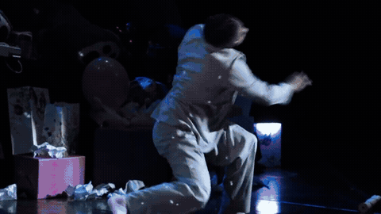
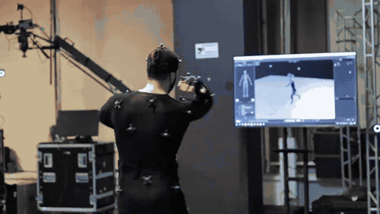
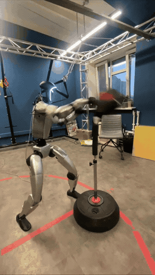

<h1 align="center">Robotics Demos</h1>

  We put humanoid robots to work: VR teleoperation, stage performances, voice control, autonomous navigation and data collection for robot learning. 
  Everything below was filmed on real hardware: <b>Unitree G1, G1-D, H1, H2</b> and <b>Go2</b>.

  <a href="#vr-teleoperation">VR Teleoperation</a> ·
  <a href="#performance--motion">Performance &amp; Motion</a> ·
  <a href="#voice-control">Voice Control</a> ·
  <a href="#autonomous-navigation">Autonomous Navigation</a> ·
  <a href="#data-collection--learning">Data Collection &amp; Learning</a> ·
  <a href="#inside-the-headset">Inside the Headset</a> ·
  <a href="#work-with-us">Work with us</a>

 

## VR Teleoperation

An operator in a VR headset drives the robot in real time: arms, hands, cameras and audio at 60 fps, over local Wi-Fi or a remote server. One app, every Unitree humanoid.

<table>
  <tr>
    <td align="center" valign="top" width="33%">
      <video src="https://github.com/user-attachments/assets/09e25bbf-195b-4f9f-aed1-4f8301ba1eeb" controls playsinline width="280"></video>
       <b>G1-D</b>
       Unitree G1-D driven from a VR headset
    </td>
    <td align="center" valign="top" width="33%">
      <video src="https://github.com/user-attachments/assets/ab7e6b79-3e08-49ad-92bc-f7c6d4114bc1" controls playsinline width="280"></video>
       <b>G1, moving camera</b>
       Same session filmed from a moving camera
    </td>
    <td align="center" valign="top" width="33%">
      <video src="https://github.com/user-attachments/assets/10fd2cf4-e4f8-4e9f-a57f-83faeffb11bb" controls playsinline width="280"></video>
       <b>G1 short clip</b>
       G1 mirroring the operator's arm motion
    </td>
  </tr>
  <tr>
    <td align="center" valign="top" width="33%">
      
       <b>H2</b>
       Unitree H2 humanoid driven live from a VR headset
    </td>
    <td align="center" valign="top" width="33%">
      <video src="https://github.com/user-attachments/assets/c63173ff-7a53-48a9-96d9-51f4a497d8ed" controls playsinline width="280"></video>
       <b>H1</b>
       Unitree H1 with the same operator app
    </td>
    <td align="center" valign="top" width="33%">
      <video src="https://github.com/user-attachments/assets/b93cbe05-5bdb-4815-8e75-94c19a0701b6" controls playsinline width="280"></video>
       <b>Two robots</b>
       Two bodies, one operator app
    </td>
  </tr>
</table>

<table>
  <tr>
    <td align="center" valign="top" width="50%">
      
       <b>G1 VR teleop promo</b>
       Unitree G1 VR teleop promo, robot arms mirror the operator
    </td>
    <td align="center" valign="top" width="50%">
      <video src="https://github.com/user-attachments/assets/8e08f781-ce43-4063-a0bd-4616c5787c33" controls playsinline width="440"></video>
       <b>Bartender demo</b>
       Serving drinks under VR teleop
    </td>
  </tr>
</table>

 

## Performance &amp; Motion

Choreography captured from a human, retargeted to the robot and performed live on stage.

<table>
  <tr>
    <td align="center" valign="top" width="50%">
      
       <b>Robot Dancer</b>
       Stage show: a Unitree G1 dancing alongside a professional dancer
    </td>
    <td align="center" valign="top" width="50%">
      
       <b>Robot Dancer, making of</b>
       Motion capture of the choreography and retargeting to the robot
    </td>
  </tr>
</table>

<table>
  <tr>
    <td align="center" valign="top" width="33%">
      
       <b>Boxing</b>
       Custom boxing motion on a Unitree G1
    </td>
    <td align="center" valign="top" width="33%">
      
       <b>Live event</b>
       On-stage VR teleop of a Unitree G1 in front of an audience
    </td>
    <td width="33%"></td>
  </tr>
</table>

 

## Voice Control

On-device speech recognition and speech synthesis: the robot hears a command, executes it and answers back. No cloud in the loop.

<table>
  <tr>
    <td align="center" valign="top" width="33%">
      
       <b>H2 voice control</b>
       Unitree H2 following spoken commands, on-device speech recognition
    </td>
    <td width="33%"></td>
    <td width="33%"></td>
  </tr>
</table>

 

## Autonomous Navigation

Lidar mapping, goal setting and path following, on a humanoid and on a quadruped.

<table>
  <tr>
    <td align="center" valign="top" width="66%">
      <video src="https://github.com/user-attachments/assets/6852f0ea-d806-41aa-8834-fdc6cb0fc626" controls playsinline width="600"></video>
       <b>G1 navigation</b>
       Unitree G1 autonomous navigation: lidar map, goal, planned path in the operator UI
    </td>
    <td align="center" valign="top" width="33%">
      
       <b>Autonomous Go2</b>
       Unitree Go2 moving by scenario to help an exhibition guide
    </td>
  </tr>
</table>

 

## Data Collection &amp; Learning

Episodes recorded during VR teleop go straight into a LeRobot dataset (cameras, state, actions, task label), ready for training policies such as ACT.

<table>
  <tr>
    <td align="center" valign="top" width="33%">
      <video src="https://github.com/user-attachments/assets/b4b156e3-2a55-4de0-979b-551a06e4c30d" controls playsinline width="280"></video>
       <b>Recording an episode</b>
       Operator view of a data-collection run
    </td>
    <td align="center" valign="top" width="33%">
      <video src="https://github.com/user-attachments/assets/17c5069a-dbd4-4f9f-84e9-2655ee00ac06" controls playsinline width="280"></video>
       <b>Same episode, robot view</b>
       What the robot's cameras recorded
    </td>
    <td width="33%"></td>
  </tr>
</table>

 

## Inside the Headset

What the operator sees, and the legend for the status bar.

<table>
  <tr>
    <td align="center" valign="top" width="50%">
      
       Stereo camera feed, hand tracking, robot pose insets, FPS and battery
    </td>
    <td align="center" valign="top" width="50%">
      
       Status bar: link quality, IMU, temperature, hand data, stereo stream
    </td>
  </tr>
</table>

 

## Work with us

The teleop stack is described in [vr-teleop](https://github.com/AShtanev/vr-teleop). We are open to collaborations, including new robot types and manufacturers, and we can give a live demo.

- Telegram: [@Ashtanev](https://t.me/Ashtanev)
- Email: [andrewblackstown@gmail.com](mailto:andrewblackstown@gmail.com)
