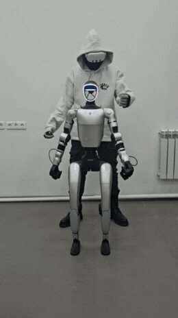
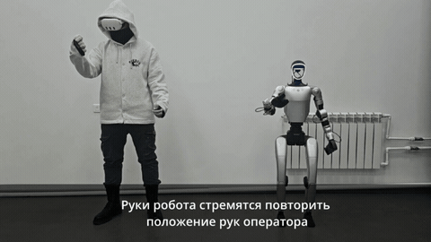
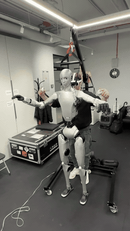
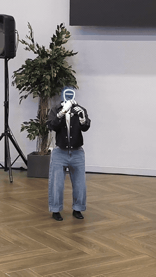
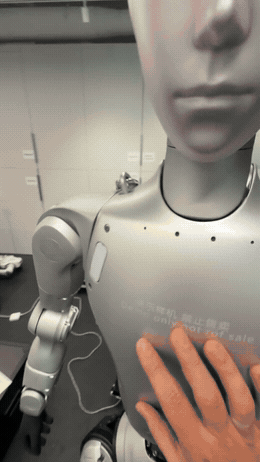
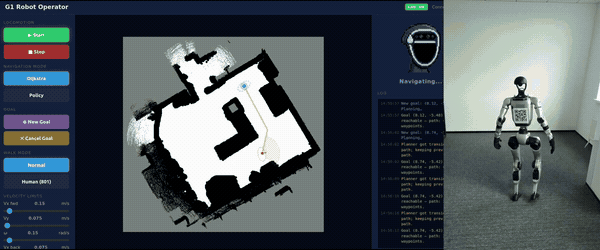
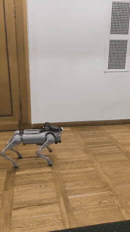
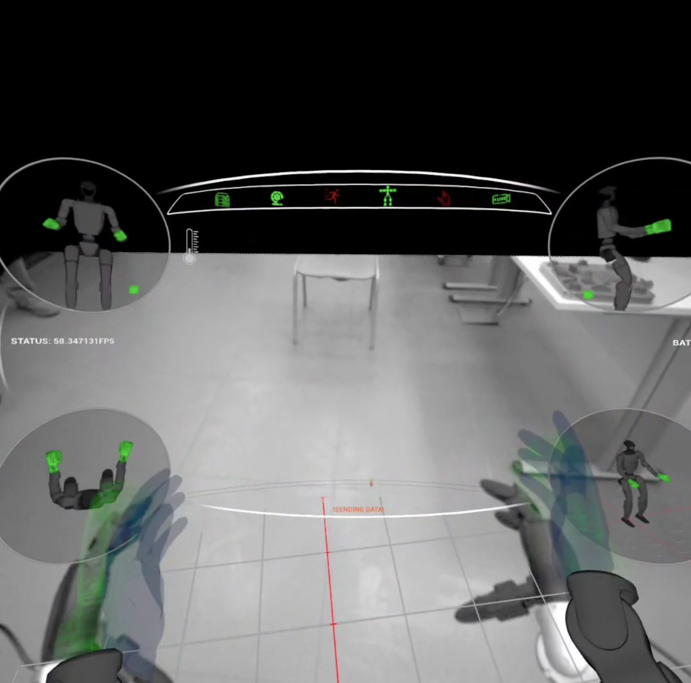
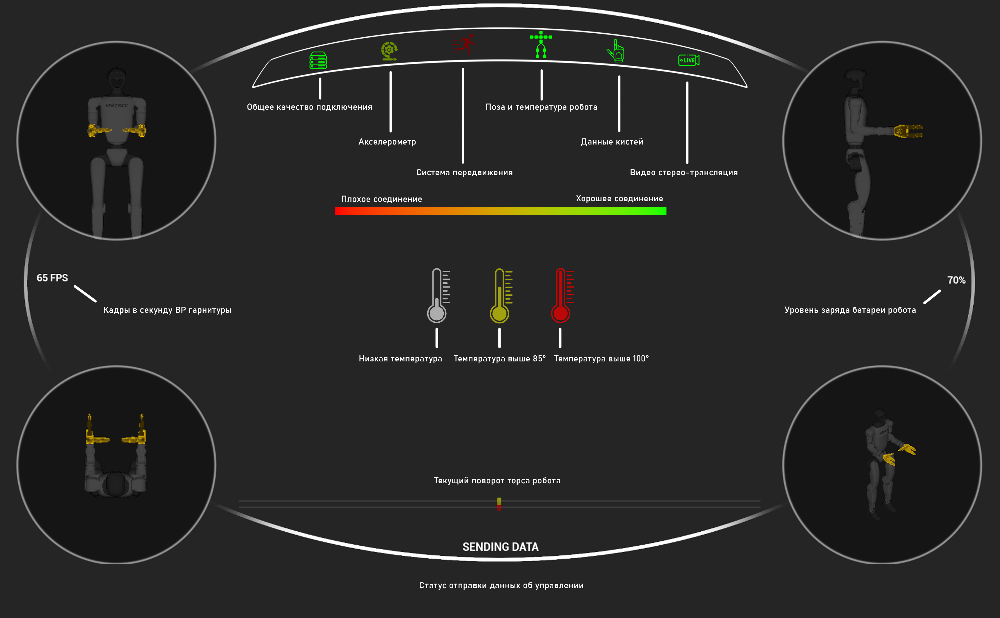

# Robotics Demos

Field footage from my work on **Unitree humanoids and quadrupeds**: VR teleoperation, voice control, autonomous navigation and data collection for imitation learning.
Robots in these clips: **Unitree G1, G1-D, H1, H2, Go2**. Product details for the teleop stack live in [vr-teleop](https://github.com/AShtanev/vr-teleop).

Every clip is stored in this repo under [`videos/`](videos). Cards with a play button are inline players; the others are looping previews, click one to open the full clip.

**Topics:** [VR Teleoperation](#vr-teleoperation) · [Voice Control](#voice-control) · [Autonomous Navigation](#autonomous-navigation) · [Data Collection & Learning](#data-collection--learning) · [Operator HUD](#operator-hud) · [All videos](#all-videos) · [Adding a video](#adding-a-video)

**Contact:** Telegram [@Ashtanev](https://t.me/Ashtanev) · [andrewblackstown@gmail.com](mailto:andrewblackstown@gmail.com)

---

## VR Teleoperation

An operator in a VR headset drives the robot in real time: arms, hands, cameras and audio at 60 fps, over local Wi-Fi or a VPS.

### Unitree G1 / G1-D

<table>
  <tr>
    <td align="center" valign="top" width="33%">
      <video src="https://github.com/user-attachments/assets/09e25bbf-195b-4f9f-aed1-4f8301ba1eeb" controls playsinline width="280"></video>
      <br><b>G1-D promo</b>
      <br><sub>Unitree G1-D driven from a VR headset · <a href="videos/teleop-promo-g1d.mp4">mp4 (1:38)</a></sub>
    </td>
    <td align="center" valign="top" width="33%">
      <video src="https://github.com/user-attachments/assets/ab7e6b79-3e08-49ad-92bc-f7c6d4114bc1" controls playsinline width="280"></video>
      <br><b>G1, moving camera</b>
      <br><sub>Same session filmed from a moving camera · <a href="videos/teleop-promo-moving-camera.mp4">mp4 (1:04)</a></sub>
    </td>
    <td align="center" valign="top" width="33%">
      <a href="videos/teleop-short-g1.mp4"></a>
      <br><b>G1 short clip</b>
      <br><sub>G1 mirroring the operator's arm motion · <a href="videos/teleop-short-g1.mp4">full video (0:11)</a></sub>
    </td>
  </tr>
</table>

<table>
  <tr>
    <td align="center" valign="top" width="50%">
      <a href="videos/teleop-promo-g1.mp4"></a>
      <br><b>G1 VR teleop promo</b>
      <br><sub>Unitree G1 VR teleop promo, robot arms mirror the operator · <a href="videos/teleop-promo-g1.mp4">full video (0:56)</a></sub>
    </td>
    <td align="center" valign="top" width="50%">
      <video src="https://github.com/user-attachments/assets/8e08f781-ce43-4063-a0bd-4616c5787c33" controls playsinline width="440"></video>
      <br><b>Bartender demo</b>
      <br><sub>Serving drinks under VR teleop · <a href="videos/robot-bartender.mp4">mp4 (1:19)</a></sub>
    </td>
  </tr>
</table>

### Unitree H1 / H2

<table>
  <tr>
    <td align="center" valign="top" width="33%">
      <a href="videos/h2-teleop.mp4"></a>
      <br><b>H2 teleop</b>
      <br><sub>Unitree H2 humanoid driven live from a VR headset · <a href="videos/h2-teleop.mp4">full video (0:17)</a></sub>
    </td>
    <td align="center" valign="top" width="33%">
      <video src="https://github.com/user-attachments/assets/c63173ff-7a53-48a9-96d9-51f4a497d8ed" controls playsinline width="280"></video>
      <br><b>H1 teleop</b>
      <br><sub>Unitree H1 with the same operator app · <a href="videos/h1.mp4">mp4 (0:23)</a></sub>
    </td>
    <td width="33%"></td>
  </tr>
</table>

### On stage and multi-robot

<table>
  <tr>
    <td align="center" valign="top" width="33%">
      <a href="videos/live-event-teleop.mp4"></a>
      <br><b>Live event</b>
      <br><sub>On-stage VR teleop of a Unitree G1 in front of an audience · <a href="videos/live-event-teleop.mp4">full video (0:16)</a></sub>
    </td>
    <td align="center" valign="top" width="33%">
      <video src="https://github.com/user-attachments/assets/b93cbe05-5bdb-4815-8e75-94c19a0701b6" controls playsinline width="280"></video>
      <br><b>Two robots</b>
      <br><sub>Two bodies, one operator app · <a href="videos/two-robots.mp4">mp4 (0:37)</a></sub>
    </td>
    <td width="33%"></td>
  </tr>
</table>

---

## Voice Control

On-device speech recognition and TTS: the robot hears a spoken command, executes it and answers back. No cloud in the loop.

<table>
  <tr>
    <td align="center" valign="top" width="33%">
      <a href="videos/h2-voice-control.mp4"></a>
      <br><b>H2 voice control</b>
      <br><sub>Unitree H2 following spoken commands, on-device speech recognition · <a href="videos/h2-voice-control.mp4">full video (0:31)</a></sub>
    </td>
    <td width="33%"></td>
    <td width="33%"></td>
  </tr>
</table>

---

## Autonomous Navigation

Lidar mapping, goal setting and path following, on a humanoid and on a quadruped.

<table>
  <tr>
    <td align="center" valign="top" width="66%">
      <a href="videos/nav-demo.mp4"></a>
      <br><b>G1 navigation demo</b>
      <br><sub>Unitree G1 autonomous navigation: lidar map, goal, planned path in the operator UI · <a href="videos/nav-demo.mp4">full video (0:40)</a></sub>
    </td>
    <td align="center" valign="top" width="33%">
      <a href="videos/autonomous-go2.mp4"></a>
      <br><b>Autonomous Go2</b>
      <br><sub>Unitree Go2 moving by scenario to help an exhibition guide · <a href="videos/autonomous-go2.mp4">full video (2:48)</a></sub>
    </td>
  </tr>
</table>

---

## Data Collection & Learning

Episodes recorded during VR teleop go straight into a LeRobot dataset (cameras, state, actions, task label), ready for training policies such as ACT.

<table>
  <tr>
    <td align="center" valign="top" width="33%">
      <video src="https://github.com/user-attachments/assets/b4b156e3-2a55-4de0-979b-551a06e4c30d" controls playsinline width="280"></video>
      <br><b>Recording an episode</b>
      <br><sub>Operator view of a data-collection run · <a href="videos/episode-recording.mp4">mp4 (0:58)</a></sub>
    </td>
    <td align="center" valign="top" width="33%">
      <video src="https://github.com/user-attachments/assets/17c5069a-dbd4-4f9f-84e9-2655ee00ac06" controls playsinline width="280"></video>
      <br><b>Same episode, robot view</b>
      <br><sub>What the robot's cameras recorded · <a href="videos/episode-recording-robot-view.mp4">mp4 (1:01)</a></sub>
    </td>
    <td width="33%"></td>
  </tr>
</table>

---

## Operator HUD

What the operator sees inside the headset, and the legend for the status bar (labels in Russian).

<table>
  <tr>
    <td align="center" valign="top" width="50%">
      
      <br><sub>Stereo camera feed, hand tracking, robot pose insets, FPS and battery</sub>
    </td>
    <td align="center" valign="top" width="50%">
      
      <br><sub>Status bar legend: link quality, IMU, temperature, hand data, stereo stream</sub>
    </td>
  </tr>
</table>

---

## All videos

| Topic | Robot | Video | Length | File |
|---|---|---|---|---|
| VR Teleoperation | G1-D | G1-D promo | 1:38 | [teleop-promo-g1d.mp4](videos/teleop-promo-g1d.mp4) |
| VR Teleoperation | G1 | G1, moving camera | 1:04 | [teleop-promo-moving-camera.mp4](videos/teleop-promo-moving-camera.mp4) |
| VR Teleoperation | G1 | G1 VR teleop promo | 0:56 | [teleop-promo-g1.mp4](videos/teleop-promo-g1.mp4) |
| VR Teleoperation | G1 | G1 short clip | 0:11 | [teleop-short-g1.mp4](videos/teleop-short-g1.mp4) |
| VR Teleoperation | G1 | Bartender demo | 1:19 | [robot-bartender.mp4](videos/robot-bartender.mp4) |
| VR Teleoperation | G1 | Live event | 0:16 | [live-event-teleop.mp4](videos/live-event-teleop.mp4) |
| VR Teleoperation | G1 | Two robots | 0:37 | [two-robots.mp4](videos/two-robots.mp4) |
| VR Teleoperation | H1 | H1 teleop | 0:23 | [h1.mp4](videos/h1.mp4) |
| VR Teleoperation | H2 | H2 teleop | 0:17 | [h2-teleop.mp4](videos/h2-teleop.mp4) |
| Voice Control | H2 | H2 voice control | 0:31 | [h2-voice-control.mp4](videos/h2-voice-control.mp4) |
| Autonomous Navigation | G1 | G1 navigation demo | 0:40 | [nav-demo.mp4](videos/nav-demo.mp4) |
| Autonomous Navigation | Go2 | Autonomous Go2 | 2:48 | [autonomous-go2.mp4](videos/autonomous-go2.mp4) |
| Data Collection | G1 | Recording an episode | 0:58 | [episode-recording.mp4](videos/episode-recording.mp4) |
| Data Collection | G1 | Same episode, robot view | 1:01 | [episode-recording-robot-view.mp4](videos/episode-recording-robot-view.mp4) |

---

## Adding a video

```
videos/    full clips, H.264 mp4, each under 10 MB
previews/  8-second looping GIF shown in the README
thumbs/    one still frame per clip
images/    screenshots and diagrams
scripts/   add_video.sh
```

1. Run the helper. It compresses the source to under 10 MB, makes the GIF preview and thumbnail, and prints a ready-to-paste card:

   ```bash
   scripts/add_video.sh ~/Downloads/new_clip.mp4 g1-warehouse-pick 5
   ```

   The last argument is the second at which the GIF preview starts (default 3).

2. Paste the printed `<td>` card into the matching topic table above, or start a new `## Topic` section using the same table layout. Add a row to [All videos](#all-videos).

3. Optional upgrade to an inline player: drag the mp4 into any GitHub issue comment box, copy the `https://github.com/user-attachments/assets/…` link it produces, and replace the `<a></a>` pair in the card with `<video src="THAT_LINK" controls playsinline width="280"></video>`.

4. Commit and push.
